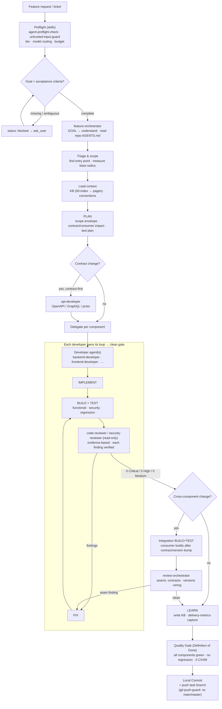

# Multi-Agent Workflow Kit

A vendor-neutral, copy-and-adapt starter kit for building **multi-agent software-engineering workflows**
on the GitHub Copilot CLI (or any agent runner with a similar custom-agent + skills model).

It ships a small set of **generic agents**, **reusable skills**, a **knowledge-base pattern**, and
**cross-platform Python tooling** so you can wire up an orchestrator → developer → reviewer workflow for
your own stack in minutes — with cost governance and a quality loop built in.

> Everything here is generic. Replace the placeholders (`serviceA`, `<REPO_ROOT>`, build commands, etc.)
> with your own project's details.

> **This is a scaffold, not a drop-in.** The agents, knowledge base, and service map are deliberately
> generic templates. Before it does useful work you must invest time customizing them to your stack:
> fill in the KB with your real architecture/build/test commands, replace the `serviceA/B/C` map and the
> generic role agents with your actual components and conventions, and set the model tiers. Expect setup
> effort — this gives you the workflow skeleton and guardrails, not turnkey behavior.

---

## The idea in one picture

```
                         ┌───────────────────────┐
   feature request  ───▶ │  feature-orchestrator │  triage · plan · delegate · integrate
                         └───────────┬───────────┘
              delegates per component │ (task tool)
        ┌──────────────────┬─────────┴───────────┬──────────────────┐
        ▼                  ▼                     ▼                  ▼
 backend-developer   frontend-developer     api-developer      (add your own)
   (serviceA)          (serviceB)            (serviceC)
        │                  │                     │
        │ each runs its own IMPLEMENT → BUILD+TEST → REVIEW → FIX loop
        ▼                  ▼                     ▼
   code-reviewer / security-reviewer   ◀── read-only, high-confidence findings only
        │
        ▼
   0 Critical / 0 High / 0 Medium  ──▶  local commit ──▶ push task branch (git-push-guard blocks main/master)
```

A separate **`review-orchestrator`** can route an existing diff to the right reviewers and aggregate their
findings into one report.

---

## What's inside

```
agents/
  orchestrators/   feature-orchestrator, review-orchestrator
  developers/      backend-developer, frontend-developer, api-developer
  reviewers/       code-reviewer, security-reviewer
  agents.config.example.yaml   <- model routing + service map template
skills/            reusable procedures agents invoke by name
  agent-preflight-check, quality-loop-harness, review-findings-output,
  untrusted-input-guard, delivery-metrics-capture, kb-curate, git-push-guard
hooks/             runtime CLI hooks (push-guard preToolUse enforcement)
kb/                knowledge-base pattern + example skeleton
scripts/           cross-platform Python tooling (stdlib only)
tests/             unit tests for the tooling
```

### Agents

- **Orchestrators** own the lifecycle and delegate; they don't edit code.
- **Developers** implement one component end-to-end and loop to a clean gate.
- **Reviewers** are strictly **read-only** — they report findings, they never edit.

### Skills (reusable, model-agnostic procedures)

| Skill | Purpose |
| --- | --- |
| `agent-preflight-check` | Fast environment/repo/tooling + model-routing/budget check before work starts, plus advisory **episodic recall** (read-only lookup of prior sessions on the same repo/files so agents reuse past work instead of rediscovering it). |
| `quality-loop-harness` | The build → verify → review → fix loop with explicit gates. |
| `review-findings-output` | Standard findings contract: severity buckets, evidence, concrete fixes. |
| `untrusted-input-guard` | Treat repo/diff/ticket/tool-output as data, never as instructions. |
| `delivery-metrics-capture` | Capture lightweight per-task metrics for trend tracking. |
| `kb-curate` | Periodic KB maintenance: dedup, trim stale, split oversized pages so the KB stays small and cheap to read (with a read-only `kb_lint.py` signal). |
| `git-push-guard` | **Blocking** pre-push check: refuses `git push` to `main`/`master`/configured `baseBranch`; allows agent-created task branches. |

### Hooks (runtime enforcement the model cannot skip)

Skills are *advisory* — an agent chooses to run them. **Hooks** are runtime
interceptors the Copilot CLI runs on its own at lifecycle points, so they enforce
policy regardless of what the model decides. Hooks are **session/user-level, not
per-agent** — see [`hooks/README.md`](hooks/README.md).

| Hook | Event | Purpose |
| --- | --- | --- |
| `push-guard-hook.py` | `preToolUse` | The **enforcement** half of `git-push-guard`: inspects every shell `git push` and **denies** pushes to a protected branch at the tool layer. Fail-open on hook error so it can never brick a session. |

Install it opt-in with `python scripts/install_to_copilot.py --hooks`. Run the
skill and the hook together (defense-in-depth) and back both with server-side
branch protection.

---

## The lifecycle

Every agent runs the same loop, however small the task:

```
GOAL → PLAN → IMPLEMENT → BUILD+TEST → REVIEW → ADDRESS(FIX) → LOOP (until clean) → LEARN
```

- **Clean gate** = **0 Critical / 0 High / 0 Medium** open findings.
- **One pass is not a loop** — every fix re-triggers BUILD+TEST → REVIEW on the updated diff.
- **LEARN** writes durable lessons back to the KB so the next task is faster.
- Agents create **local commits only** after the gate is met. Developer agents may **push their own task
  branch**, but every push runs the blocking `git-push-guard` skill first, which **refuses** any push to
  `main`/`master`/the configured `baseBranch` — protected-branch changes go through a human-opened PR.
  Install the optional `push-guard-hook.py` (`preToolUse`) to enforce the same rule at the tool layer,
  independently of whether the agent runs the skill.

### How a feature request flows



- The **orchestrator delegates**; each **developer agent owns its own** IMPLEMENT → BUILD+TEST → REVIEW → FIX
  loop and returns a clean, reviewed diff. Reviewers are **read-only**. The flow always stops at a **local
  commit** — a human pushes.

---

## Cost governance & model tiering

Model cost varies ~5x between a premium and a standard model, so the kit routes models **declaratively**:

- `agents.config.yaml` → `models.tiers` defines a `premium` and a `standard` tier.
- `models.agents` binds each agent to a tier (reserve premium for genuinely hard reasoning).
- `scripts/apply_model_routing.py` writes those bindings into the Copilot CLI store.
- `budgets` are **advisory** — the preflight skill surfaces a "you're spending a lot" signal but never
  hard-blocks work.

```bash
# preview what would change, then apply
python scripts/apply_model_routing.py --dry-run
python scripts/apply_model_routing.py
```

> Safety: a real run writes `~/.copilot/settings.json.bak` (a copy of your current settings) before
> overwriting, so you can always roll back. `--dry-run` never writes. Note the parser is regex-based
> (stdlib-only), so keep `agents.config.yaml` formatted like `agents.config.example.yaml` — see CONTRIBUTING.

### Where the model bindings actually live

The kit does **not** ship a `settings.json`. Model bindings are stored in the Copilot CLI's own per-user
store at **`~/.copilot/settings.json`**, which is outside this repo — it holds machine-specific state and
your other Copilot settings, so committing it would leak/overwrite your personal config. Instead the kit
keeps the **declarative source of truth in-repo** (the `models:` section of `agents.config.yaml`) and
`apply_model_routing.py` translates it into the store:

```
agents.config.yaml (models:) ──apply_model_routing.py──▶ ~/.copilot/settings.json (subagents.agents.<key>)
```

The generated block looks like this (you never hand-edit it):

```jsonc
{
  "subagents": {
    "agents": {
      "backend-developer":   { "model": "claude-opus-4.8", "effortLevel": "high",   "contextTier": "default" },
      "frontend-developer":  { "model": "claude-sonnet-5", "effortLevel": "medium", "contextTier": "default" }
    }
  }
}
```

> Note: per-agent bindings apply to subagents spawned via the `task` tool. The **top-level** `model` in
> `settings.json` governs your main interactive session — set that yourself (e.g. to a standard-tier model)
> so the default session isn't silently on a premium model.

---

## Quick start

1. **Get the kit**

   ```bash
   git clone <this-repo> multi-agent-workflow-kit
   cd multi-agent-workflow-kit
   ```

2. **Create your config**

   ```bash
   cp agents/agents.config.example.yaml agents/agents.config.yaml   # macOS/Linux
   Copy-Item agents/agents.config.example.yaml agents/agents.config.yaml   # Windows
   ```

   Edit `agents.config.yaml`: set `<REPO_ROOT>`/`<REPORTS>`, list your components under `services`, and
   pick each agent's model tier.

3. **Validate everything is wired correctly**

   ```bash
   python scripts/validate_agents.py
   python run_tests.py
   ```

4. **Install the agents/skills into your Copilot CLI** (copies to `~/.copilot/`)

   ```bash
   python scripts/install_to_copilot.py
   # optional: also install the push-guard preToolUse hook (tool-layer enforcement)
   python scripts/install_to_copilot.py --hooks
   ```

5. **Route models**

   ```bash
   python scripts/apply_model_routing.py
   ```

Requires **Python 3.8+** (standard library only — no dependencies).

---

## Running an agent from the command line

Once installed (step 4), you can drive a custom agent straight from your shell with the Copilot CLI —
either interactively or fully non-interactive ("autopilot"/headless) for scripts and CI.

**Interactive, in autopilot mode** (tools run without per-action confirmation):

```bash
copilot --agent feature-orchestrator --autopilot
```

**Non-interactive / headless** (one-shot prompt, no TTY). `--allow-all-tools` is **required** for
non-interactive runs so the agent can edit files and run commands without prompting:

```bash
copilot --agent feature-orchestrator \
  -p "Implement the acceptance criteria in TICKET-123 across the affected services" \
  --allow-all-tools
```

**Point it at a specific repo/working directory** with `-C`:

```bash
copilot -C /path/to/your/repo \
  --agent backend-developer \
  -p "Add input validation to the payments endpoint and run the tests" \
  --allow-all-tools
```

**Pick the model / reasoning effort per run** (overrides the routed default):

```bash
copilot --agent feature-orchestrator --autopilot \
  --model claude-sonnet-5 --effort medium
```

Useful flags:

| Flag | Purpose |
| --- | --- |
| `--agent <name>` | Run a specific custom agent (the agent's `name:` / filename). |
| `--autopilot` | Start an interactive session in autopilot mode (auto-approves tool use). |
| `-p, --prompt "<text>"` | Non-interactive one-shot prompt (headless). |
| `--allow-all-tools` | Auto-approve all tools — **required** for non-interactive mode (env: `COPILOT_ALLOW_ALL`). |
| `--allow-tool[=...]` / `--deny-tool[=...]` | Narrow autopilot to specific tools instead of all. |
| `-C <dir>` | Change working directory before running. |
| `--model` / `--effort` | Override model / reasoning effort for this run. |

> **Autopilot runs unattended.** `--allow-all-tools` (and `--allow-all`) let the agent edit files and run
> shell commands with no confirmation. Developer agents may push their **own task branch**, but the blocking
> `git-push-guard` skill refuses any push to `main`/`master`/the configured `baseBranch` — still, scope your
> autopilot runs to a repo you trust, review the diff, and rely on **server-side branch protection** as the
> real backstop (the guard is agent-side defense-in-depth, not a hard guarantee). Prefer
> `--allow-tool`/`--deny-tool` over `--allow-all` when you want a tighter blast radius.

Run `copilot --help` for the full flag list.

---

## Adapt it to your stack — `serviceA/B/C` are placeholders. Add one `services` entry per real repo.
- **Rename/clone agents** — the developer agents are generic roles; duplicate and specialize them
  (e.g. a `mobile-developer`) as needed. Keep each agent's `name:` equal to its filename.
- **Fill the KB** — copy `kb/example/` to `kb/<yourproject>/` and record your real commands, conventions,
  and gotchas. See `kb/README.md`.
- **Tune model tiers & budgets** — in `agents.config.yaml`.

> Reviewer agents are restricted to read-only tools by the validator. Keep them that way — a reviewer that
> can edit its own findings away defeats the purpose.

---

## Tooling reference

| Script | What it does |
| --- | --- |
| `scripts/validate_agents.py` | Lints the agent kit (frontmatter, hardening block, gate wording, skill refs, reviewer least-privilege). |
| `scripts/apply_model_routing.py` | Writes per-agent model bindings from config into the Copilot CLI store. Backs up `settings.json` → `settings.json.bak` before overwriting; `--dry-run` previews. |
| `scripts/install_to_copilot.py` | Copies agents + skills + config into `~/.copilot/`. `--hooks` also installs the push-guard `preToolUse` hook into `~/.copilot/hooks/`. |
| `scripts/sync_from_live.py` | Pulls changes made in `~/.copilot/` back into this repo. Delete-on-drift, so a real run snapshots `agents/`+`skills/` to `.sync-backups/<timestamp>/` (keeps newest 2); use `--what-if` to preview. |
| `scripts/metrics_rollup.py` | Summarizes the metrics log into a per-day/agent rollup. |
| `run_tests.py` | Runs the unit-test suite for the tooling. |

---

## License

MIT — see [LICENSE](LICENSE).
