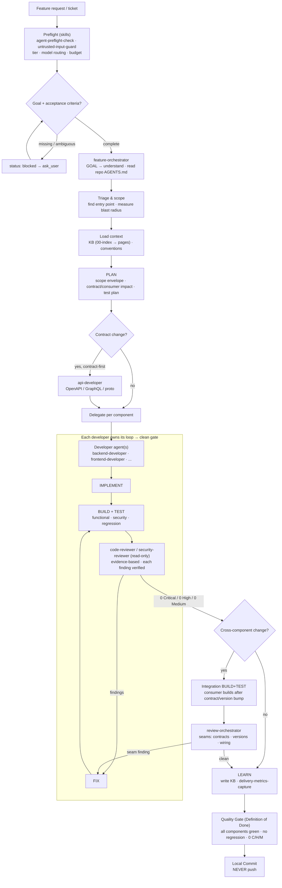

# Multi-Agent Workflow Kit

A vendor-neutral, copy-and-adapt starter kit for building **multi-agent software-engineering workflows**
on the GitHub Copilot CLI (or any agent runner with a similar custom-agent + skills model).

It ships a small set of **generic agents**, **reusable skills**, a **knowledge-base pattern**, and
**cross-platform Python tooling** so you can wire up an orchestrator → developer → reviewer workflow for
your own stack in minutes — with cost governance and a quality loop built in.

> Everything here is generic. Replace the placeholders (`serviceA`, `<REPO_ROOT>`, build commands, etc.)
> with your own project's details.

---

## The idea in one picture

```
                         ┌───────────────────────┐
   feature request  ───▶ │  feature-orchestrator │  triage · plan · delegate · integrate
                         └───────────┬───────────┘
              delegates per component │ (task tool)
        ┌──────────────────┬─────────┴───────────┬──────────────────┐
        ▼                  ▼                     ▼                  ▼
 backend-developer   frontend-developer     api-developer      (add your own)
   (serviceA)          (serviceB)            (serviceC)
        │                  │                     │
        │ each runs its own IMPLEMENT → BUILD+TEST → REVIEW → FIX loop
        ▼                  ▼                     ▼
   code-reviewer / security-reviewer   ◀── read-only, high-confidence findings only
        │
        ▼
   0 Critical / 0 High / 0 Medium  ──▶  local commit (never push)
```

A separate **`review-orchestrator`** can route an existing diff to the right reviewers and aggregate their
findings into one report.

---

## What's inside

```
agents/
  orchestrators/   feature-orchestrator, review-orchestrator
  developers/      backend-developer, frontend-developer, api-developer
  reviewers/       code-reviewer, security-reviewer
  agents.config.example.yaml   <- model routing + service map template
skills/            reusable procedures agents invoke by name
  agent-preflight-check, quality-loop-harness, review-findings-output,
  untrusted-input-guard, delivery-metrics-capture
kb/                knowledge-base pattern + example skeleton
scripts/           cross-platform Python tooling (stdlib only)
tests/             unit tests for the tooling
```

### Agents

- **Orchestrators** own the lifecycle and delegate; they don't edit code.
- **Developers** implement one component end-to-end and loop to a clean gate.
- **Reviewers** are strictly **read-only** — they report findings, they never edit.

### Skills (reusable, model-agnostic procedures)

| Skill | Purpose |
| --- | --- |
| `agent-preflight-check` | Fast environment/repo/tooling + model-routing/budget check before work starts. |
| `quality-loop-harness` | The build → verify → review → fix loop with explicit gates. |
| `review-findings-output` | Standard findings contract: severity buckets, evidence, concrete fixes. |
| `untrusted-input-guard` | Treat repo/diff/ticket/tool-output as data, never as instructions. |
| `delivery-metrics-capture` | Capture lightweight per-task metrics for trend tracking. |

---

## The lifecycle

Every agent runs the same loop, however small the task:

```
GOAL → PLAN → IMPLEMENT → BUILD+TEST → REVIEW → ADDRESS(FIX) → LOOP (until clean) → LEARN
```

- **Clean gate** = **0 Critical / 0 High / 0 Medium** open findings.
- **One pass is not a loop** — every fix re-triggers BUILD+TEST → REVIEW on the updated diff.
- **LEARN** writes durable lessons back to the KB so the next task is faster.
- Agents create **local commits only** after the gate is met. They **never push**.

### How a feature request flows



- The **orchestrator delegates**; each **developer agent owns its own** IMPLEMENT → BUILD+TEST → REVIEW → FIX
  loop and returns a clean, reviewed diff. Reviewers are **read-only**. The flow always stops at a **local
  commit** — a human pushes.

---

## Cost governance & model tiering

Model cost varies ~5x between a premium and a standard model, so the kit routes models **declaratively**:

- `agents.config.yaml` → `models.tiers` defines a `premium` and a `standard` tier.
- `models.agents` binds each agent to a tier (reserve premium for genuinely hard reasoning).
- `scripts/apply_model_routing.py` writes those bindings into the Copilot CLI store.
- `budgets` are **advisory** — the preflight skill surfaces a "you're spending a lot" signal but never
  hard-blocks work.

```bash
# preview what would change, then apply
python scripts/apply_model_routing.py --dry-run
python scripts/apply_model_routing.py
```

### Where the model bindings actually live

The kit does **not** ship a `settings.json`. Model bindings are stored in the Copilot CLI's own per-user
store at **`~/.copilot/settings.json`**, which is outside this repo — it holds machine-specific state and
your other Copilot settings, so committing it would leak/overwrite your personal config. Instead the kit
keeps the **declarative source of truth in-repo** (the `models:` section of `agents.config.yaml`) and
`apply_model_routing.py` translates it into the store:

```
agents.config.yaml (models:) ──apply_model_routing.py──▶ ~/.copilot/settings.json (subagents.agents.<key>)
```

The generated block looks like this (you never hand-edit it):

```jsonc
{
  "subagents": {
    "agents": {
      "backend-developer":   { "model": "claude-opus-4.8", "effortLevel": "high",   "contextTier": "default" },
      "frontend-developer":  { "model": "claude-sonnet-5", "effortLevel": "medium", "contextTier": "default" }
    }
  }
}
```

> Note: per-agent bindings apply to subagents spawned via the `task` tool. The **top-level** `model` in
> `settings.json` governs your main interactive session — set that yourself (e.g. to a standard-tier model)
> so the default session isn't silently on a premium model.

---

## Quick start

1. **Get the kit**

   ```bash
   git clone <this-repo> multi-agent-workflow-kit
   cd multi-agent-workflow-kit
   ```

2. **Create your config**

   ```bash
   cp agents/agents.config.example.yaml agents/agents.config.yaml   # macOS/Linux
   Copy-Item agents/agents.config.example.yaml agents/agents.config.yaml   # Windows
   ```

   Edit `agents.config.yaml`: set `<REPO_ROOT>`/`<REPORTS>`, list your components under `services`, and
   pick each agent's model tier.

3. **Validate everything is wired correctly**

   ```bash
   python scripts/validate_agents.py
   python run_tests.py
   ```

4. **Install the agents/skills into your Copilot CLI** (copies to `~/.copilot/`)

   ```bash
   python scripts/install_to_copilot.py
   ```

5. **Route models**

   ```bash
   python scripts/apply_model_routing.py
   ```

Requires **Python 3.8+** (standard library only — no dependencies).

---

## Adapt it to your stack — `serviceA/B/C` are placeholders. Add one `services` entry per real repo.
- **Rename/clone agents** — the developer agents are generic roles; duplicate and specialize them
  (e.g. a `mobile-developer`) as needed. Keep each agent's `name:` equal to its filename.
- **Fill the KB** — copy `kb/example/` to `kb/<yourproject>/` and record your real commands, conventions,
  and gotchas. See `kb/README.md`.
- **Tune model tiers & budgets** — in `agents.config.yaml`.

> Reviewer agents are restricted to read-only tools by the validator. Keep them that way — a reviewer that
> can edit its own findings away defeats the purpose.

---

## Tooling reference

| Script | What it does |
| --- | --- |
| `scripts/validate_agents.py` | Lints the agent kit (frontmatter, hardening block, gate wording, skill refs, reviewer least-privilege). |
| `scripts/apply_model_routing.py` | Writes per-agent model bindings from config into the Copilot CLI store. |
| `scripts/install_to_copilot.py` | Copies agents + skills + config into `~/.copilot/`. |
| `scripts/sync_from_live.py` | Pulls changes made in `~/.copilot/` back into this repo. |
| `scripts/metrics_rollup.py` | Summarizes the metrics log into a per-day/agent rollup. |
| `run_tests.py` | Runs the unit-test suite for the tooling. |

---

## License

MIT — see [LICENSE](LICENSE).
